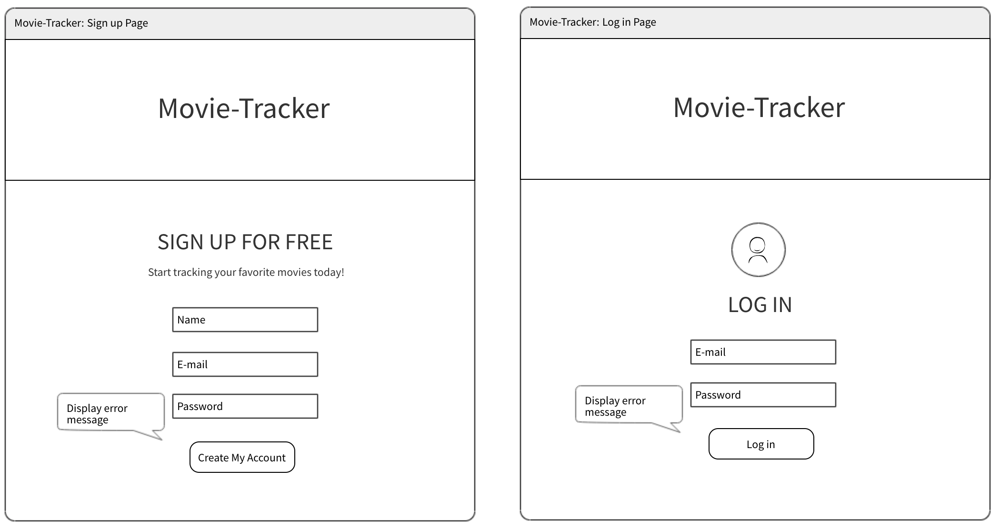
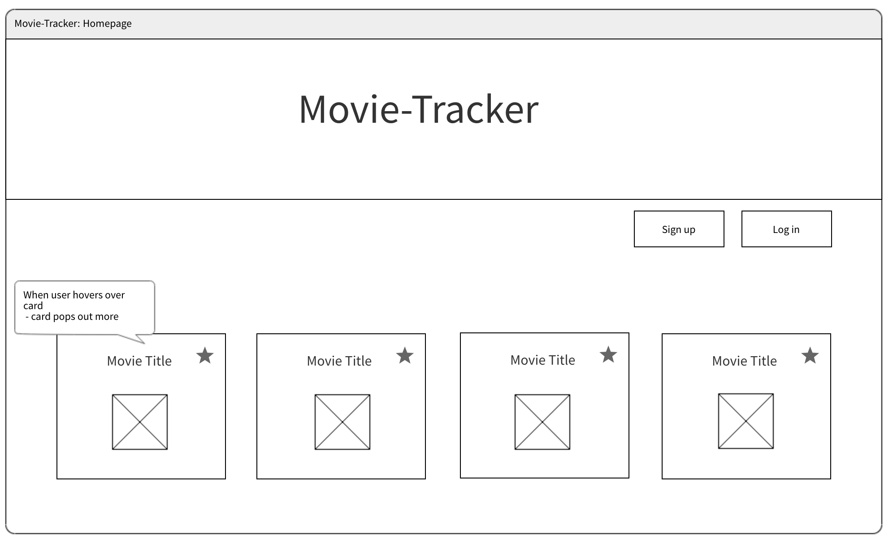

# Movie Tracker

The goal of this project was to create an application where a user can sign in/out and save their favorite movies. This was our first project using React Router and Redux. The movie data is from the [TMDb API](https://www.themoviedb.org/documentation/api).

### Set-Up Frontend:
Clone this repo  
Run `npm install` from the root directory  
Run `npm start` and visit localhost:3000 in your browser  

### Preview:

### Primary Technologies Used:
* React
* Redux
* React Router
* JavaScript
* CSS/SCSS

### Testing:
Jest and Enzyme for front-end testing  
Run `npm test` from the root directory  

### Original Assignment: 
[Movie Tracker](https://github.com/turingschool-examples/movie-tracker) project from Turing School of Software and Design  

### Contributors:  
[Heather Hartley](https://github.com/hlhartley)  
[Tiffany Bachmann](https://github.com/trbachmann)  

### Wireframes:

This project was bootstrapped with [Create React App](https://github.com/facebook/create-react-app).
